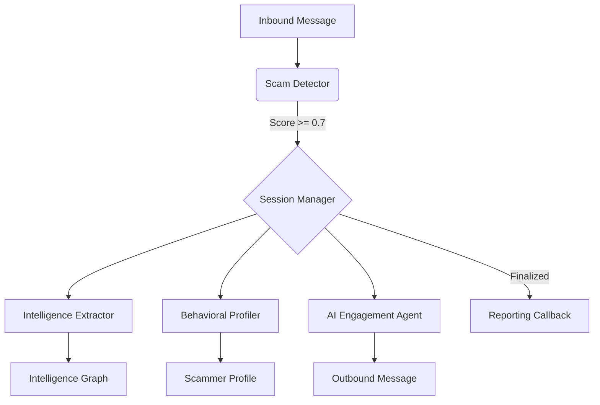

# Comprehensive Implementation Documentation: Agentic Honeypot

## 🎯 System Overview

The **Agentic Honeypot** is an enterprise-grade, autonomous platform designed to detect scam attempts, proactively engage scammers using believable AI personas, and extract actionable intelligence (PII, financial accounts, etc.) for reporting and analysis.

---

## 🏗️ Architecture

The system follows a modular, pipeline-based architecture:

---

## 🚀 Core Features & Implementation

### 1. 🤖 AI Engagement Engine (`ai_agent.py`)

The engine uses a sophisticated rule-based system (upgradable to LLM) to maintain believable personas.

- **Dynamic Personas**:
    - **Elderly**: Confused, trusting, uses formal language.
    - **Eager**: Impulsive, uses many exclamation marks, high fear of missing out.
    - **Cautious**: Skeptical, asks for verification, wants proof.
    - **Tech Novice**: Struggles with UI/UX, needs hand-holding.
- **State-Based Strategies**:
    - **Initial**: Interest/Confusion (Building rapport).
    - **Engagement**: Probing questions (Building trust).
    - **Trust Building**: Sharing "fake" PII (Baiting).
    - **Information Gathering**: Requesting scammer's details.
    - **Extraction**: Pressuring the scammer to share payment info.
- **Realism Features**:
    - **Typo Injection**: Automatically injects realistic typos based on persona traits.
    - **Context Awareness**: Remembers shared details to avoid contradictions.

### 2. 🔍 Intelligence Extraction System (`intelligence_extractor.py`)

Extracts structured data using context-aware patterns and strict validation.

- **Supported Data Types**:
    - **Bank Accounts**: 9-18 digit numbers near "A/C" or "Account" keywords.
    - **IFSC Codes**: Validates against standard 11-character Indian banking format.
    - **UPI IDs**: Detects common handles (e.g., @oksbi, @paytm) and generic users if preceded by "UPI" keyword.
    - **Phone Numbers**: Extracts Indian and international formats.
    - **Phishing Links**: Detects malicious URLs, IPs, and shortened links (bit.ly, etc.).
- **Smart Logic**:
    - **Negative Context Filtering**: Prevents misclassifying account numbers as phone numbers by checking nearby keywords.
    - **Cross-Message Completion**: If a message says "Account No:" and the next contains only numbers, they are stitched together.

### 3. 🔄 Session & State Management (`session_manager.py`)

Manages the lifecycle of a scam engagement from first contact to report generation.

- **Lifecycle States**:
    - `INIT`: Detecting the scam.
    - `ENGAGED`: Active conversation.
    - `FINALIZED`: Extraction complete or scammer disengaged.
- **Finalization Logic**:
    - **Idle Timeout**: Automatically finalizes sessions after 60s of inactivity.
    - **Max Turns**: Enforces a 15-turn limit to ensure timely reporting and resource efficiency.
- **Intelligence Graph**: Merges partial data from multiple turns into a single unified profile for the scammer.

### 📊 Behavioral Profiling (`behavioral_profiler.py`)

Analyzes the scammer's tactics in real-world time:
- **Urgency**: Detects time-pressure keywords ("now", "immediately").
- **Fear**: Identifies threat-based language ("blocked", "compromised").
- **Greed**: Spots "prize" or "reward" baiting.
- **Aggression Level**: Tracks the intensity of the scammer's tone.

---

## 📋 Data Modeling & Specifications (`models.py`)

The system is built on **strict Pydantic models** to ensure 100% compliance with official hackathon specifications.

### API Request Schema (`HoneypotRequest`)
- `sessionId`: Unique identifier for the conversation.
- `message`: Current inbound message object (sender, text, timestamp).
- `conversationHistory`: Array of all previous messages in the session.
- `metadata`: Optional channel info (language, locale).

### API Response Schema (`HoneypotResponse`)
- `status`: Always `"success"`.
- `reply`: The AI-generated persona response.

### Callback Schema (`FinalCallbackPayload`)
- `sessionId`: Tracking ID.
- `scamDetected`: Boolean indicator.
- `totalMessagesExchanged`: Metrics for engagement depth.
- `extractedIntelligence`: CamelCase object containing all discovered data.
- `agentNotes`: Detailed summary of behaviors and extracted items.

---

## 📡 Integration & Reporting

### Mandatory Callback (`callback.py`)
Upon session finalization, the system sends a detailed JSON payload to the pre-configured callback URL:
- Total messages exchanged.
- Full extracted intelligence list.
- Scammer behavioral profile.
- Conversation summary.

### API Specifications (`main.py`)
- **Endpoints**:
    - `POST /api/conversation/message`: Primary entry point for messages.
    - `GET /api/stats`: Real-time dashboard metrics.
    - `GET /api/session/{id}`: Full debug state retrieval.

---

## 🛠️ Recent Improvements

- **Enhanced Phone Extraction**: Implemented positive context boosting. If "phone" or "mobile" is mentioned, the system is more lenient, allowing extraction even if account-related keywords are nearby. This fixed issues with mixed-detail messages.
- **State Machine Optimization**: Improved transition logic between "Trust Building" and "Information Gathering" stages.
