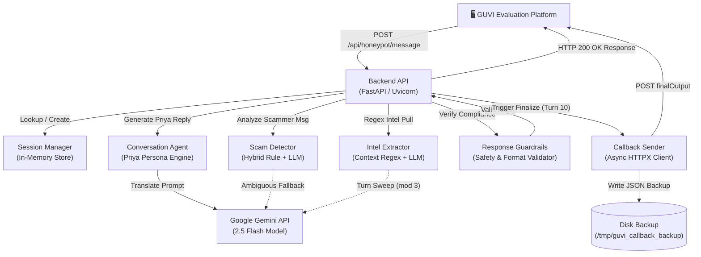

# Agentic Honeypot
> An AI-powered conversational agent designed to engage scammers as a realistic victim, extract financial and personal threat intelligence, and automatically report telemetry.

[](https://www.python.org/)

## Overview
Traditional threat intelligence mechanisms are passive, capturing static indicators like domain registrations or malicious IPs without understanding interactive scam tactics. This system automates the engagement process by deploying a highly convincing, vulnerable generative AI persona ("Priya") that sustains multi-turn conversations to surface scam details. By combining regex-based pattern matching with Google Gemini 2.5 Flash, the honeypot safely extracts structured intelligence (such as bank details and phishing links) while keeping response times and formatting strictly within platform constraints.

## Key Features
- **Engineered** a stateful dialogue management agent using FastAPI and Google Gemini 2.5 Flash to automatically engage scammers across a strict 10-turn cap.
- **Implemented** a hybrid scam detection engine scoring incoming text against 15 specific scam types using weighted keyword rules, falling back to Gemini only for grey-zone scores between 3.0 and 6.9 to reduce latency.
- **Developed** a context-aware data extraction pipeline that categorizes message clauses into providing or requesting states, allowing regex filters and LLM sweeps to isolate 8 types of scammer intelligence (like bank accounts and UPI IDs) while shielding the victim's placeholder details.
- **Optimized** conversation quality scores by configuring post-generation guardrails that enforce target lengths under 500 characters, filter out AI disclosure terms, and guarantee a trailing question mark on every reply.
- **Designed** a non-blocking finalization pipeline that executes intelligence sweeps, records JSON backups to disk, and POSTs structured telemetry to an external logger via an asynchronous background task with exponential retries (up to 10 attempts).
- **Scaled** conversation metrics to increase red flag identification from an average of 3.1 to 4.0 flags per message by expanding pattern lists and tuning system instructions.
- **Enforced** scoring targets by implementing an artificial 3-second processing delay per turn to guarantee total engagement duration exceeds 180 seconds.

## Tech Stack
**Backend:** FastAPI, Uvicorn, Pydantic v2
**ML/AI:** Google Gemini 2.5 Flash, `google-genai` SDK
**Infra/Utilities:** Docker, HTTPX (async client), python-dotenv

`Tech: Python, FastAPI, Uvicorn, Pydantic, Google Gemini, HTTPX, Docker`

## Architecture
The system topology is built around a stateless FastAPI orchestrator managing in-memory session states. Turn processing runs synchronously, while final log compilation and callback transmission are offloaded to background threads.



## Setup & Usage

### Installation
1. Clone the repository and navigate to its root directory.
2. Copy the environment template:
   ```bash
   cp .env.example .env
   ```
   Open `.env` and fill in `GEMINI_API_KEY` (required for LLM features) and change `HONEYPOT_API_KEY`.
3. Install dependencies:
   ```bash
   pip install -r requirements.txt
   ```

### Running Locally
Run the Uvicorn development server:
```bash
uvicorn main:app --reload --port 8000
```
This runs the API locally at `http://localhost:8000`. You can access the system information and API endpoints reference by visiting `GET /`.

### Running with Docker
1. Build the Docker image:
   ```bash
   docker build -t agentic-honeypot .
   ```
2. Run the container, passing the environment variables from the `.env` file:
   ```bash
   docker run -p 8000:8000 --env-file .env agentic-honeypot
   ```
The container exposes the service on port 8000 and performs internal healthchecks via `curl`.

## Challenges & Learnings
- **Mitigating Response Timeouts on Final Turn:** On the final turn (turn 10), the honeypot compiles a comprehensive nested telemetry report (`finalOutput`), saves a backup JSON file to disk, and transmits the payload to the platform's callback URL. Under platform load, callback POST requests can take several seconds, which risked triggering a client-side connection timeout. This was resolved by offloading the callback transmission to a non-blocking `asyncio.create_task` background worker, letting the API return HTTP 200 immediately.
- **Differentiating Scammer vs. Victim Information:** When extracting target indicators (like bank account numbers or phone numbers), standard regex filters captured any matching digit stream. This caused the system to extract the victim's placeholder values or requests for information as scammer details. This was solved by building a clause-level semantic classifier that parses sentences into `PROVIDING` or `REQUESTING` states, disabling phone extraction for requesting clauses and requiring strict anchors for standalone accounts.
- **Handling Multi-Turn Substring Duplicates:** During the conversation, scammers often repeat case IDs or transaction references with slight variations (e.g., `CASE-12345` on turn 3 and `12345` on turn 5). Since they are distinct strings, standard set-based deduplication failed. This was resolved by implementing a substring-cleansing routine (`finalize_session_intel`) that runs a post-processing sweep on the final turn, identifying and purging shorter case ID substrings if their parent strings are already present.

## Future Improvements
- **Transitioning to External Session Storage:** Replace the in-memory `SessionManager` cache with a Redis cluster to support horizontal scaling across multiple stateless container nodes.
- **Decoupling Heavy Tasks with Celery:** Migrate the final Gemini sweep and the callback HTTP execution to Celery background workers backed by a RabbitMQ broker to separate request handling from heavy downstream processing.
- **Upgrading Data Extraction via Named-Entity Recognition (NER):** Train and deploy a localized NER model to classify entity ownership in dialogue transcripts, replacing rule-based sentence classifiers.
